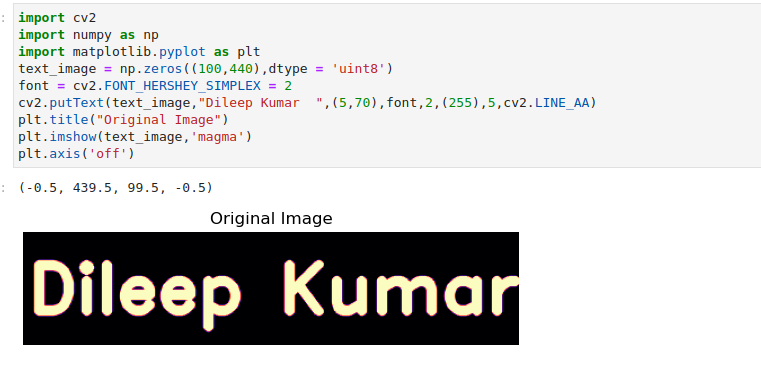
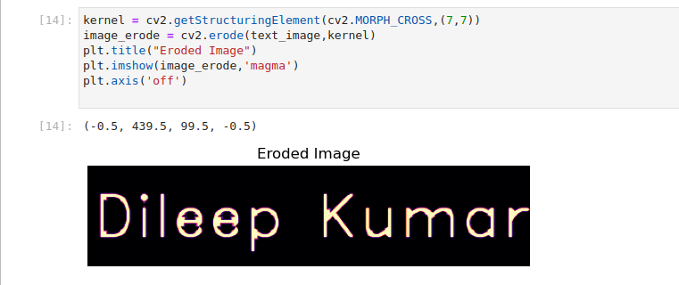
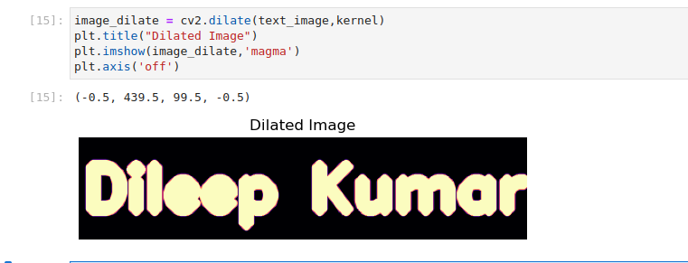

# Implementation-of-Erosion-and-Dilation
## Aim
To implement Erosion and Dilation using Python and OpenCV.
## Software Required
1. Anaconda - Python 3.7
2. OpenCV
## Algorithm:
### Step1:
Import the necessary packages.


### Step2:
Create the text image using cv2.putText.

### Step3:
Then create the structuring image for dilation/erosion.

### Step4:
Apply erosion and dilation using cv2.erode and cv2.dilate.


### Step5:
Plot the images using plt.imshow.

 
## Program:

``` Python
## Developed by :Gumma Dileep Kumar
## Register no: 212222240032
```
# Import the necessary packages
```python
import cv2
import numpy as np
import matplotlib.pyplot as plt
```


# Create the Text using cv2.putText
```python

text_image = np.zeros((100,440),dtype = 'uint8')
font = cv2.FONT_HERSHEY_SIMPLEX = 2
cv2.putText(text_image,"Dileep Kumar",(5,70),font,2,(255),5,cv2.LINE_AA)
plt.title("Original Image")
plt.imshow(text_image,'magma')
plt.axis('off')
```


# Create the structuring element
```python

kernel = cv2.getStructuringElement(cv2.MORPH_CROSS,(7,7))
```

# Erode the image
```python

image_erode = cv2.erode(text_image,kernel)
plt.title("Eroded Image")
plt.imshow(image_erode,'magma')
plt.axis('off')
```

# Dilate the image
```python
image_dilate = cv2.dilate(text_image,kernel)
plt.title("Dilated Image")
plt.imshow(image_dilate,'magma')
plt.axis('off')


```
## Output:

### Display the input Image


### Display the Eroded Image


### Display the Dilated Image


## Result
Thus the generated text image is eroded and dilated using python and OpenCV.